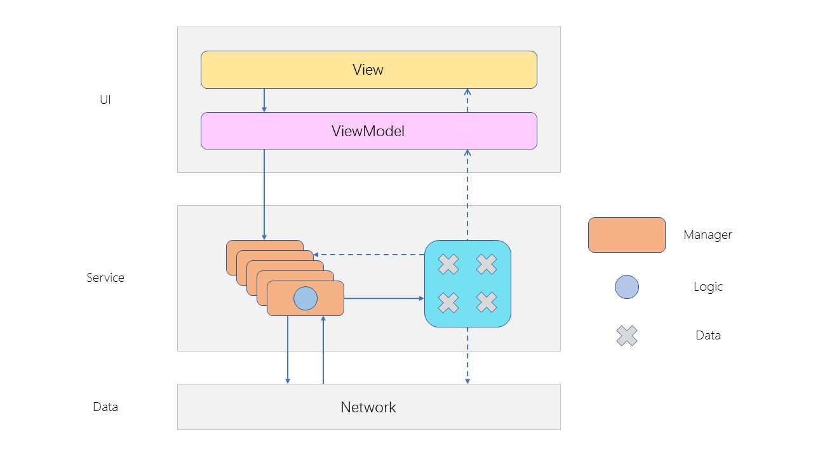
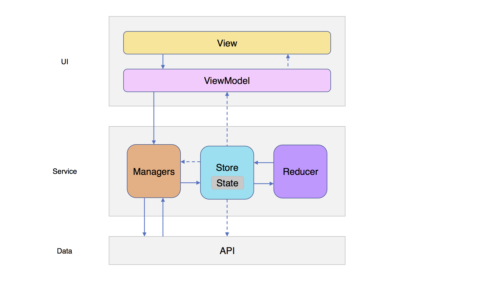

#Redux in ObjC - 分离逻辑与数据

Keyword: iOS, Objective-C, MVVM, RAC, Redux

##前言


在这个架构中，UI层采用MVVM模式，Service层负责处理业务逻辑，Data层负责底层的网络请求等业务。
Service层中有多个Manager，每个Manager负责不同类型的业务逻辑，同时也会存储一些状态、数据。
Manager之间也会相互引用交互，访问相互所会有的数据。
随着业务复杂程度的不断提高，Manager之间的关系也会变得越来越混乱，数据



理想的架构是将Manager中的业务逻辑与数据分离，这样即使Manager之间的关系有多么的复杂，也能够保证数据不会出现问题。

##什么是Redux？

说到Redux，就不得不提Flux。Flux是由Facebook开发、用于构建客户端Web应用的一个架构，它的核心理念是“让数据单向流动”。而Redux，可以将其看作以Flux为基础的一个演进版本。


View：UI，向用户展示的界面
Action：用户的操作
Store：一般情况下是唯一的，负责存储、管理State，分配Action给Reducer。
State：实际上是一种数据结构，而且是只读的，唯一能改变它的地方是在Reducer。
Reducer：根据Store传来的Action以及State来。。。

利用Redux的特性，我们可以非常方便地来管理和控制数据的流向。

##Redux改



既然Redux这么好，那我们来抄一下吧。哦不，应该叫借鉴。

将Redux的View换成Manager，利用Redux的思想，我们可以将Manager中原有的业务逻辑与数据分离。

##实现


Demo结构

Data层中的NumberGenerator负责生成随机数，模拟网络请求，返回数据。
Service层中的GeneratorManager负责获取随机数，OperateManager负责对数据进行增删操作。

#####Action

Action包含操作方式以及数据（可为空）

```objectivec
typedef NS_ENUM(NSInteger, ActionType) {
    ActionTypeFetchNumber = 0,
    ActionTypeAddNumber,
    ActionTypeDeleteNumber
};

@interface Action : NSObject

@property (nonatomic, assign, readonly) ActionType type;
@property (nonatomic, strong, readonly, nullable) id payload;

- (nonnull instancetype)initWithActionType:(ActionType)type payload:(nullable id)payload;

@end
```

#####State

用于储存数据

```objectivec
@interface State : NSObject <NSCopying>

@property (nonatomic, copy) NSArray *numberArray;

@end
```

#####Reducer

```objectivec
@class State;
@class Action;

typedef void (^ReducerBlock)(State **state, Action *action);

@interface Reducer : NSObject

+ (NSArray *)reducerBlocks;

@end

@implementation Reducer

+ (NSArray *)reducerBlocks {
    return @[ [self actionReducer] ];
}

+ (ReducerBlock)actionReducer {
    ReducerBlock block = ^(State **state, Action *action) {
        State *newState = *state;
        switch (action.type) {

            case ActionTypeFetchNumber: {
                newState.numberArray = action.payload;
                break;
            }

            case ActionTypeAddNumber: {
                NSMutableArray *temp;
                if (newState.numberArray) {
                    temp = [newState.numberArray mutableCopy];
                } else {
                    temp = [NSMutableArray array];
                }
                [temp insertObject:action.payload atIndex:0];
                newState.numberArray = [temp copy];
                break;
            }

            case ActionTypeDeleteNumber: {
                NSMutableArray *temp;
                if (newState.numberArray) {
                    temp = [newState.numberArray mutableCopy];
                    NSNumber *index = action.payload;
                    [temp removeObjectAtIndex:index.integerValue];
                    newState.numberArray = [temp copy];
                }
                break;
            }

            default:
                break;
        }
    };
    return block;
}

@end
```

#####Store

```objectivec
@class Action;
@class RACSignal;

@interface Store : NSObject

@property (nonatomic, strong, readonly) RACSignal *arrayState;

+ (instancetype)sharedInstance;

- (void)dispatchAction:(Action *)action;

@end

@interface Store ()

@property (nonatomic, strong, readwrite) RACSignal *arrayState;

@property (nonatomic, strong) dispatch_queue_t serialQueue;
@property (nonatomic, copy  ) NSArray<ReducerBlock> *reducers;
@property (nonatomic, strong) State *state;

@end

@implementation Store

+ (instancetype)sharedInstance {
    static Store *store;
    static dispatch_once_t onceToken;
    dispatch_once(&onceToken, ^{
        store = [[Store alloc] init];
    });
    return store;
}

- (instancetype)init {
    if (self = [super init]) {
        _serialQueue = dispatch_queue_create("com.reduxObjc.queue", DISPATCH_QUEUE_SERIAL);
    }
    return self;
}

- (void)dispatchAction:(Action *)action {
    dispatch_async(self.serialQueue, ^{
        State *newState = [self.state copy];
        for (ReducerBlock block in self.reducers) {
            block(&newState, action);
        }
        self.state = newState;
    });
}

- (State *)state {
    if (!_state) {
        _state = [[State alloc] init];
    }
    return _state;
}

- (RACSignal *)arrayState {
    if (!_arrayState) {
        _arrayState = RACObserve(self, state.numberArray);
    }
    return _arrayState;
}

- (NSArray<ReducerBlock> *)reducers {
    if (!_reducers) {
        _reducers = [Reducer reducerBlocks];
    }
    return _reducers;
}

@end
```

##结语
对于一般简单的项目来说，并不需要使用这种方式来分离逻辑和数据，用了反而多此一举。但对于复杂的项目，
