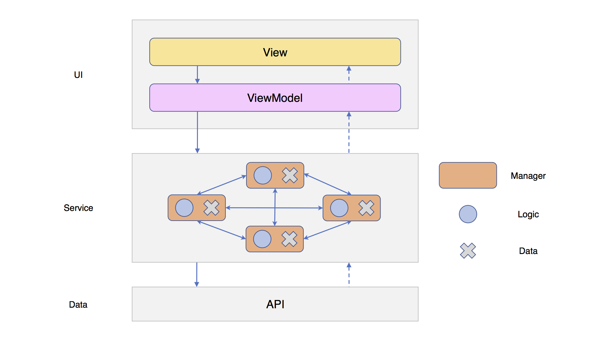
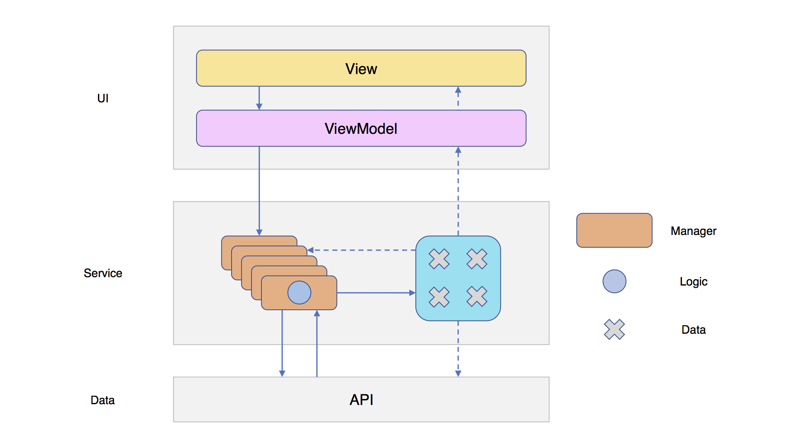
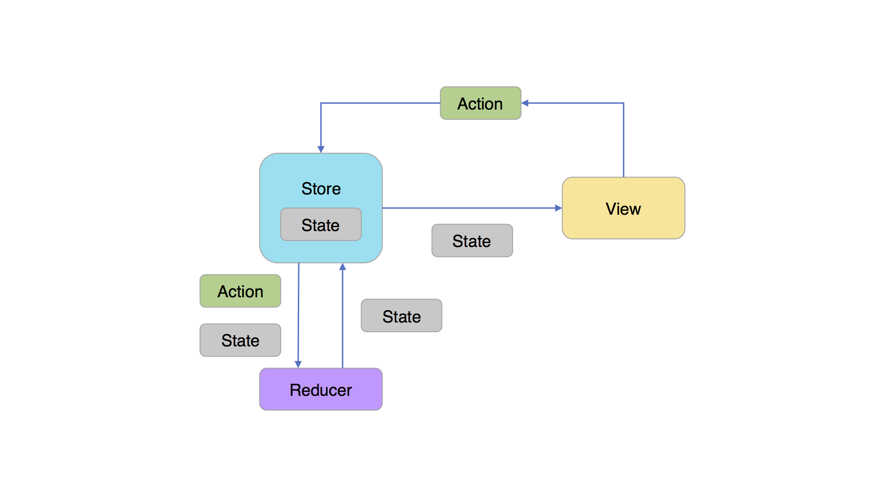
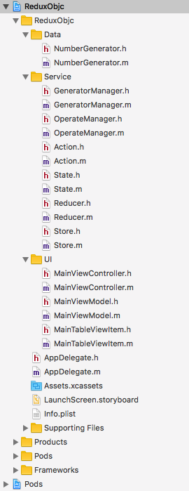

#Redux in ObjC - 食用指南

Keyword: iOS, Objective-C, MVVM, RAC, Redux

##源



在这个架构中，UI层采用MVVM模式，Service层负责处理业务逻辑，Data层负责底层的网络请求等业务。

Service层中有多个Manager，每个Manager负责不同类型的业务逻辑，同时也会存储一些状态、数据。

Manager之间也会相互调用，以及访问各自的数据。

随着业务内容的不断增加，Manager之间的关系也会变得越来越复杂，数据的相互调用很容易发生错误。



理想的情况是将Manager中的业务逻辑与数据分离，这样即使Manager之间的关系有多么地复杂，也能够保证数据的高度独立性，不容易出现问题。

##引

说到Redux，就不得不提Flux。Flux是由Facebook开发、用于构建客户端Web应用的一个架构，它的核心理念是“让数据单向流动”。利用Flux，我们可以非常方便地来管理和控制数据的流向。而Redux，可以将其看作以Flux为基础的一个演进版本。

在Swift语言中有ReSwift这样一个框架，它将Redux的思想应用到了iOS开发中。



上图为ReSwift的主要架构

- View：UI，向用户展示的界面。
- Action：把数据传到Store的有效载荷，是Store中数据的唯一来源。它有可能是来自服务器的响应，或者是用户的输入。
- Store：负责存储、管理State，分配Action给Reducer。
- State：实际上是一种数据结构，而且是只读的，唯一能改变它的地方在Reducer。
- Reducer：负责更新State的地方

##改


将ReSwift的View换成Manager，利用Redux的思想，我们可以将Manager中原有的业务逻辑与数据分离。

Manager只负责逻辑业务，如何储存数据以及如何操作数据则全部交由Store去处理。

流程：

1. 当Manager获取到数据或者数据需要改动的时候，会向Store发送一个Action，Action包含着对数据处理的方式以及数据本身（可空）。

2. Store收到来自Manager的Action后，会连同自身存储的State一并交给Reducer，Reducer会根据Action中的操作方式来对数据进行处理。

3. Store中的State被改变后，可以通过观察者模式来获取最新的数据。

##现

####Demo结构



Data层中的NumberGenerator负责生成随机数，模拟网络请求，返回数据。

Service层中的GeneratorManager负责获取随机数，OperateManager负责对数据进行增删操作。

UI层订阅Store中的数据，并将其显示给用户。

####Action

Action包含操作方式以及数据，其中数据可以为空。

`Action.h`
```objectivec
typedef NS_ENUM(NSInteger, ActionType) {
    ActionTypeFetchNumber = 0,
    ActionTypeAddNumber,
    ActionTypeDeleteNumber
};

NS_ASSUME_NONNULL_BEGIN

@interface Action : NSObject

+ (instancetype)type:(ActionType)type payload:(nullable id)payload;

@property (nonatomic, assign, readonly) ActionType type;
@property (nonatomic, strong, readonly, nullable) id payload;

@end

NS_ASSUME_NONNULL_END
```

####State

储存数据的载体。

`State.h`
```objectivec
@interface State : NSObject <NSCopying>

@property (nonatomic, copy) NSArray *numberArray;

@end
```

####Reducer

根据业务的复杂程度，Reducer可以有多个，Store将会在Reducer的集合中历遍，以寻找对应能跟操作State的方法。

`Reducer.h`
```objectivec
@class State;
@class Action;

typedef void (^ReducerBlock)(State **, Action *);

@interface Reducer : NSObject

+ (NSArray *)reducerBlocks;

@end
```

`Reducer.m`
```objectivec
@implementation Reducer

+ (NSArray *)reducerBlocks {
    return @[ [self actionReducer] ];
}

+ (ReducerBlock)actionReducer {
    ReducerBlock block = ^(State **state, Action *action) {
        State *newState = *state;
        switch (action.type) {

            case ActionTypeFetchNumber: {
                newState.numberArray = action.payload;
                break;
            }

            case ActionTypeAddNumber: {
                NSMutableArray *temp;
                temp = newState.numberArray ? [newState.numberArray mutableCopy] : [NSMutableArray array];
                [temp insertObject:action.payload atIndex:0];
                newState.numberArray = [temp copy];
                break;
            }

            case ActionTypeDeleteNumber: {
                NSMutableArray *temp;
                if (newState.numberArray) {
                    temp = [newState.numberArray mutableCopy];
                    NSNumber *index = action.payload;
                    [temp removeObjectAtIndex:index.integerValue];
                    newState.numberArray = [temp copy];
                }
                break;
            }

            default:
                break;
        }
    };
    return block;
}

@end
```

####Store

Store， 单例。
- 拥有一条串行队列保证每一时刻只有一个Action在执行。
- dispatch方法会把Action分发给Reducer。
- 分配任务给Reducer的时候，将会把当前的State复制一份，并将拷贝结果的地址作为参数传入，让Reducer直接在该地址上对数据进行操作，以提高性能。

(*注)
Reducer原有的定义为：
`(previousState, action) => newState`
传入旧的State，创建并返回新的State。

`Store.h`
```objectivec
@class Action;
@class RACSignal;

@interface Store : NSObject

+ (instancetype)sharedInstance;

@property (nonatomic, strong, readonly) RACSignal *stateSignal;

- (void)dispatchAction:(Action *)action;

@end
```

`Store.m`
```objectivec
@interface Store ()

@property (nonatomic, strong, readwrite) RACSignal *stateSignal;

@property (nonatomic, strong) dispatch_queue_t serialQueue;
@property (nonatomic, copy  ) NSArray<ReducerBlock> *reducers;
@property (nonatomic, strong) State *state;

@end

@implementation Store

+ (instancetype)sharedInstance {
    static Store *store;
    static dispatch_once_t onceToken;
    dispatch_once(&onceToken, ^{
        store = [[Store alloc] init];
    });
    return store;
}

- (instancetype)init {
    if (self = [super init]) {
        _serialQueue = dispatch_queue_create("com.reduxObjc.queue", DISPATCH_QUEUE_SERIAL);
    }
    return self;
}

- (void)dispatchAction:(Action *)action {
    dispatch_async(self.serialQueue, ^{
        State *newState = [self.state copy];
        for (ReducerBlock block in self.reducers) {
            block(&newState, action);
        }
        self.state = newState;
    });
}

#pragma mark - Lazy Loading

- (State *)state {
    if (!_state) {
        _state = [[State alloc] init];
    }
    return _state;
}

- (RACSignal *)stateSignal {
    if (!_stateSignal) {
        _stateSignal = RACObserve(self, state);
    }
    return _stateSignal;
}

- (NSArray<ReducerBlock> *)reducers {
    if (!_reducers) {
        _reducers = [Reducer reducerBlocks];
    }
    return _reducers;
}

@end
```

以下为RAC版本

```objectivec
- (RACScheduler *)scheduler {
    if (!_scheduler) {
        _scheduler = [[RACTargetQueueScheduler alloc] initWithName:@"ReduxObjc" targetQueue:self.serialQueue];
    }
    return _scheduler;
}
```

```objectivec
- (RACSignal *)dispatchSignal:(Action *)action {
    return [RACSignal createSignal:^RACDisposable *(id<RACSubscriber> subscriber) {
        return [self.scheduler schedule:^{
            State *newState = [self.state copy];
            for (ReducerBlock block in self.reducers) {
                block(&newState, action);
            }
            self.state = newState;
            [subscriber sendCompleted];
        }];
    }];
}
```

##终
优点：逻辑数据分离，结构清晰，易于维护，保证数据安全。

缺点：搭建略为麻烦，不适合小项目，性能较差。

对于一般简单的项目，并不需要使用这种方式来分离逻辑和数据，用了反而多此一举。但对于复杂的项目来说，值得一试。
